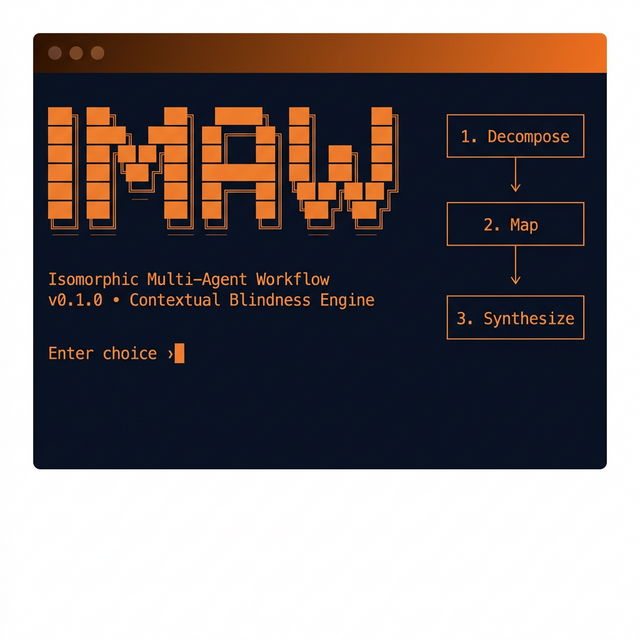

<p align="center">
  
</p>

<h1 align="center">Isomorphic Multi-Agent Workflow (IMAW)</h1>

<p align="center">
  <strong>A Generative Control Architecture that prevents structural corruption in AI-generated explanations.</strong>
</p>

<p align="center">
  <a href="https://controlarc.com"></a>
  <a href="#"></a>
  <a href="LICENSE"></a>
  <a href="#"></a>
</p>

---

When AI explains a complex system through a metaphor, source-domain jargon almost always leaks into the output — a phenomenon we call **Semantic Leakage**. The analogy starts well but breaks down as technical terms contaminate the narrative. IMAW prevents this through **Contextual Blindness** — splitting the translation across four isolated agents, each physically denied access to information that could cause contamination. The result is a metaphor with absolute structural fidelity: you can reason inside it, ask follow-up questions, and trust what you find.

## Quickstart

```bash
# 1. Clone
git clone https://github.com/creativeAlgebra/isomorphic-multi-agent-workflow.git
cd isomorphic-multi-agent-workflow

# 2. Create a virtual environment
python3 -m venv venv && source venv/bin/activate

# 3. Install dependencies
pip install -r requirements.txt
pip install -e .

# 4. Set your API key (pick ONE)
export GOOGLE_GENAI_API_KEY='your-key-here'   # Google Gemini (default)
# export OPENAI_API_KEY='sk-...'              # OpenAI
# export ANTHROPIC_API_KEY='sk-ant-...'       # Anthropic
# export GROQ_API_KEY='gsk_...'               # Groq (fast + free tier)
# export MISTRAL_API_KEY='...'                # Mistral
# export DEEPSEEK_API_KEY='...'               # DeepSeek

# 5. Launch the CLI
python cli.py
```

That's it. The CLI will auto-detect your key and walk you through everything.

## Supported Providers

| Provider | Env Var | Default Model | Notes |
|---|---|---|---|
| Google Gemini | `GOOGLE_GENAI_API_KEY` | `gemini-2.5-pro` | Default, native structured output |
| OpenAI | `OPENAI_API_KEY` | `gpt-4o` | JSON mode via response_format |
| Anthropic | `ANTHROPIC_API_KEY` | `claude-sonnet-4-20250514` | JSON via system prompt |
| Groq | `GROQ_API_KEY` | `llama-3.3-70b-versatile` | Blazing fast, free tier |
| Mistral | `MISTRAL_API_KEY` | `mistral-large-latest` | OpenAI-compatible |
| DeepSeek | `DEEPSEEK_API_KEY` | `deepseek-chat` | OpenAI-compatible |

If multiple keys are set, the CLI will ask you to choose.

## What the CLI Does

The interactive CLI presents two modes:

| Mode | What It Does |
|------|-------------|
| **🔬 See It Work** | Runs a pre-loaded example (TCP/IP → Castle Diplomacy) through the live 4-agent pipeline, then lets you inspect every artifact. |
| **🎓 Explore a Topic** | Enter your own source concept and target metaphor, run the pipeline, then chat with the Isomorphic Tutor using the Double-Translation Loop. |

After a pipeline run, the **Session Menu** lets you:
- Inspect each agent's output (abstract schema, mapping dictionary, final lesson, decode key)
- View what each agent received (prompt summaries for full transparency)
- Continue exploring via the **Double-Translation Loop** tutor chat
- Export the entire session to disk

### The Conversational Experience

IMAW is not just a one-shot lesson generator. Once the pipeline runs, you enter a **persistent, immersive chat** within the metaphor. The Double-Translation Loop works like this:

1. **You ask a question** — in either metaphor language ("What does the Head Butler do when a Wing is full?") or source language ("How does kube-scheduler handle resource exhaustion?"). Either works.
2. **Reverse-translate** — Your question is mapped backwards through the established translation dictionary into abstract schema terms.
3. **Technical Oracle** — An agent with access to the source material answers the abstract question with factual accuracy.
4. **Forward-translate** — The technical answer is rendered back into the metaphor using the same mapping dictionary. You never leave the immersive experience.

The mapping dictionary stays **frozen** throughout the conversation — "Head Butler" always means the same thing. This guarantees structural consistency across an arbitrary number of turns.

### Adaptive Schema Expansion

What happens when you ask about something *beyond* the original source material? Good learners do this naturally — they get curious and go deeper.

Without Adaptive Schema Expansion, the system improvises new metaphorical terms on the fly, but those terms are created by an agent with full context (source + metaphor), reintroducing the leakage risk the pipeline was designed to eliminate.

With Adaptive Schema Expansion (enabled by default via `auto_expand=True`), the system detects out-of-schema questions and triggers a **scoped mini-pipeline**:

1. The Oracle identifies entities absent from the current schema.
2. A scoped Decomposition step extracts *only* the new sub-concept (blind to metaphor).
3. The Mapping Agent extends the existing dictionary following its established conventions (blind to source).
4. The forward-translator responds using the *expanded* dictionary.

The expanded mapping persists for the rest of the session. Contextual Blindness is preserved even for dynamically introduced material.

## Architecture: The Multi-Agent Pipeline

The core insight is **Contextual Blindness** — physically separating the workflow so no single agent can cross-pollinate domains.

```
┌─────────────────────┐
│   Source Concept     │
│   (e.g., TCP/IP)    │
└────────┬────────────┘
         │
         ▼
┌─────────────────────┐
│  Agent 1: Decompose │  Strips all domain jargon → pure abstract schema
│  (Blind to target)  │  Output: entities, relationships, rules (JSON)
└────────┬────────────┘
         │
         ▼
┌─────────────────────┐
│  Agent 2: Map       │  Builds 1:1 translation dictionary
│  (Blind to source)  │  Abstract entities → metaphor entities
└────────┬────────────┘
         │
         ▼
┌─────────────────────┐
│  Agent 3: Synthesize│  Assembles lesson entirely within the metaphor
│  (Blind to source   │  Zero chance of leakage
│   AND schema)       │
└────────┬────────────┘
         │
         ▼
┌─────────────────────┐
│  Agent 4: Decode Key│  Side-by-side Rosetta Stone mapping
│  (Full context)     │  metaphor ↔ reality
└─────────────────────┘
```

## Project Structure

```
isomorphic-multi-agent-workflow/
├── cli.py                  # Interactive terminal UI (Rich + InquirerPy)
├── setup.py                # pip install -e .
├── requirements.txt        # Runtime dependencies
├── generate_evidence.py    # Empirical test suite (IMAW vs monolithic LLM)
├── test_corpus.py          # 50 source/metaphor pairs across 12 domains
├── agents/                 # Individual agent implementations
│   ├── decomposition.py    # Agent 1 — structural extraction
│   ├── mapping.py          # Agent 2 — isomorphic translation
│   ├── compiler.py         # Agent 3 — narrative synthesis
│   ├── decode_key.py       # Agent 4 — side-by-side decode key
│   └── tutor.py            # Double-Translation Loop + Adaptive Schema Expansion
├── imaw/                   # Core library (importable package)
│   ├── orchestrator.py     # 4-agent pipeline orchestration
│   ├── session.py          # TutorSession — mutable mapping, auto-expand, logging
│   └── agents/             # Package-level agent implementations
├── docs/
│   ├── GETTING_STARTED.md  # Setup guide
│   └── ARCHITECTURE.md     # Deep dive into methodology
├── CONTRIBUTING.md         # How to contribute
└── LICENSE                 # MIT
```

## Empirical Validation

The `generate_evidence.py` suite runs an automated A/B test: a Monolithic LLM (best-practice Chain-of-Thought prompting) vs. the 4-agent IMAW pipeline, across **50 source concepts** spanning 12 domain categories (infrastructure, finance, biology, networking, physics, law, chemistry, strategy, CS theory, social science, arts, ecology).

Each output is graded by an independent **LLM-as-Judge** for binary Semantic Leakage: *does the metaphorical lesson contain ANY explicit source-domain vocabulary?*

```bash
# Smoke test (2 concepts)
python generate_evidence.py --dry-run

# Full 50-concept run
python generate_evidence.py

# Custom count
python generate_evidence.py --count 10
```

Results are saved as CSV (per-concept data) and Markdown (formatted report with headline tables) to `/tmp/imaw_evidence/` by default. Set `IMAW_OUTPUT_DIR` to customize.

> Full methodology and results are documented in the [research paper](https://controlarc.com).

## Links

- 🌐 [Website & Paper](https://controlarc.com) — Full paper with empirical validation results
- 📄 [Architecture Deep Dive](docs/ARCHITECTURE.md) — Technical methodology
- 🤝 [Contributing](CONTRIBUTING.md) — How to help

## License

[MIT](LICENSE) — Copyright (c) 2026 The IMAW Project